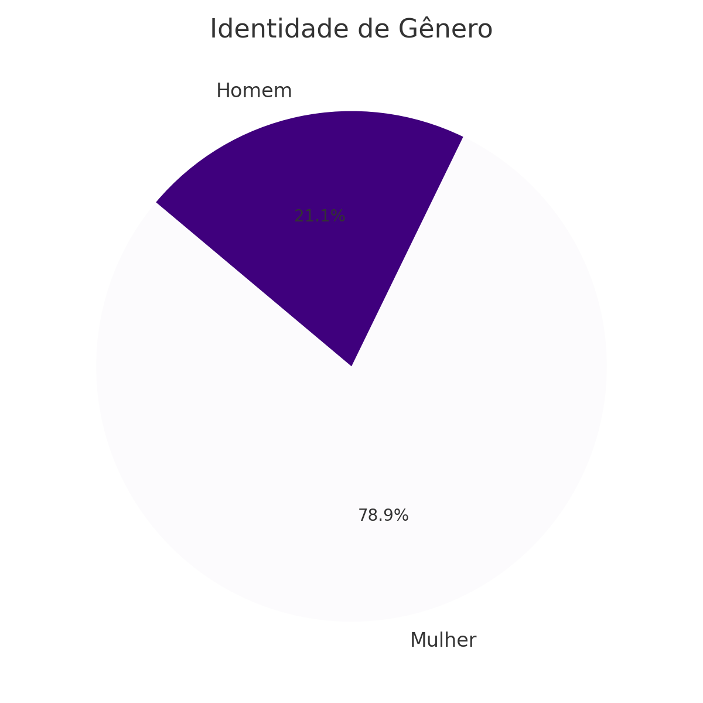
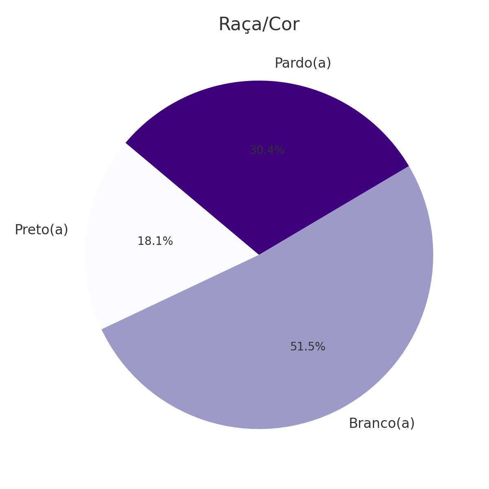
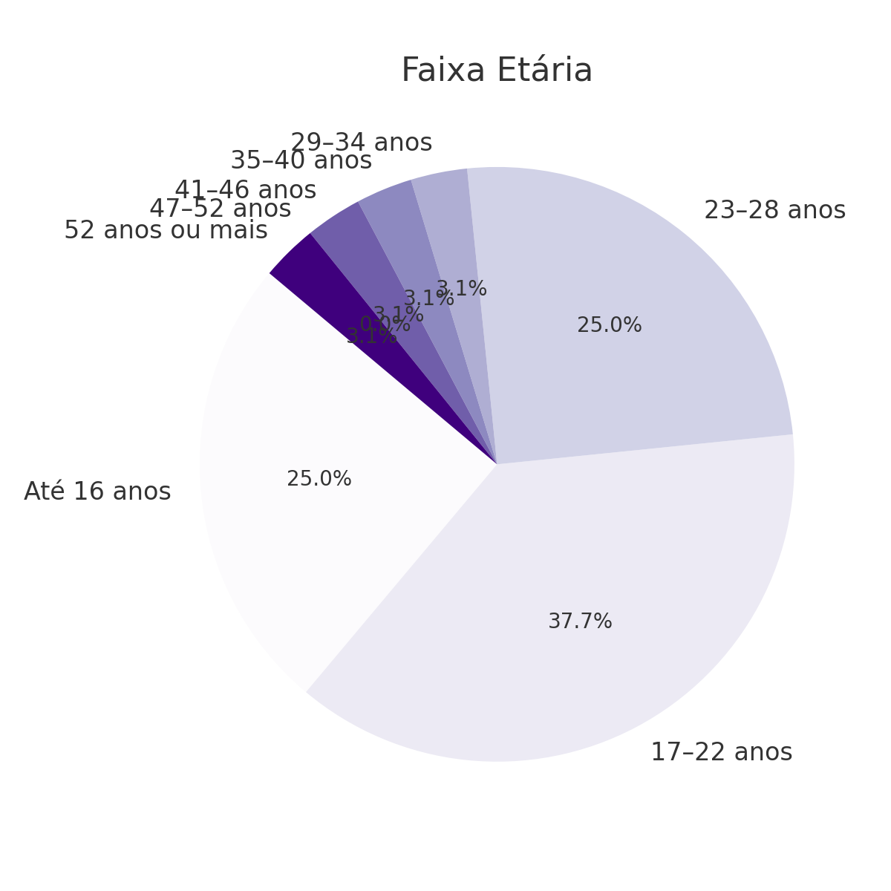
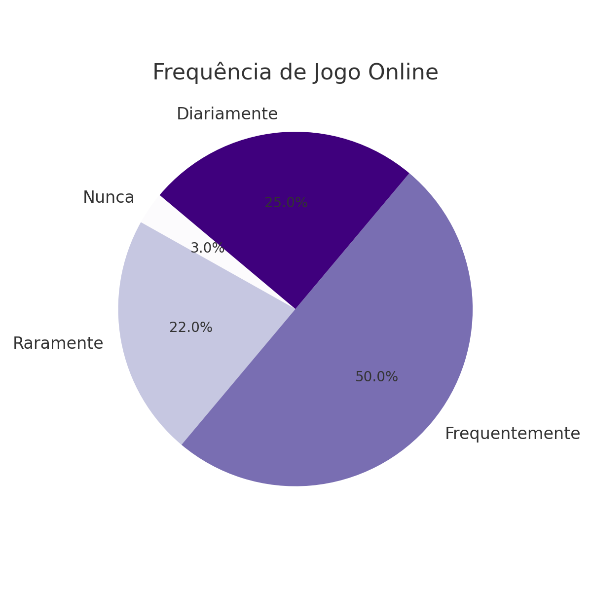
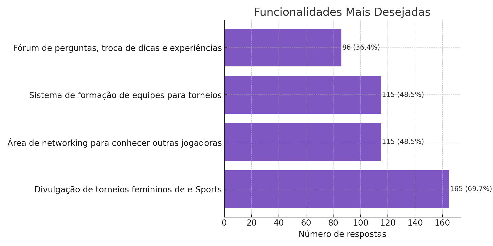
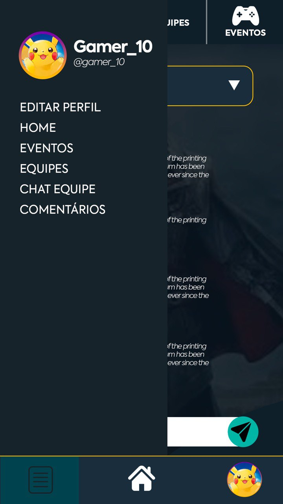
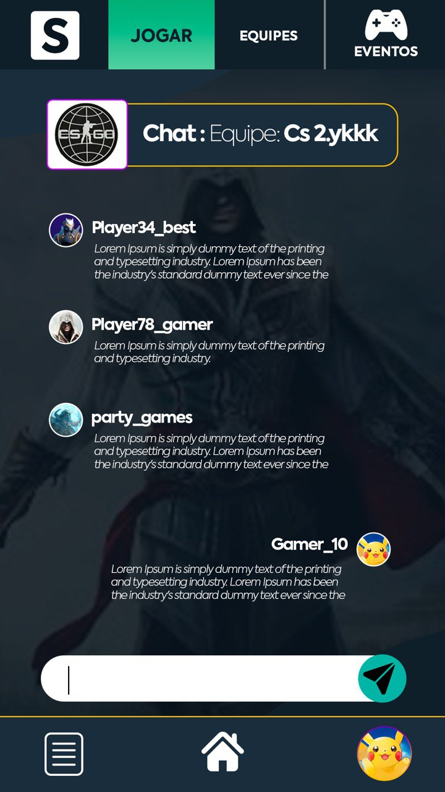
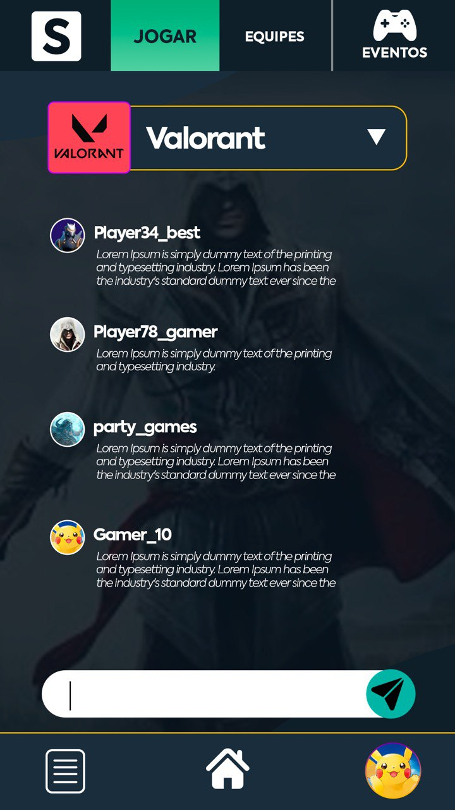

<h1 align="center">STRAVOX.GG: Plataforma Inclusiva para Mulheres nos e-Sports</h1>

<strong>Projeto de Iniciação Tecnológica – Centro Universitário do Distrito Federal (PIBIT)</strong>

<em>Curso: Ciência da Computação • Ano: 2024–2025</em>

---

## Sobre o Projeto

**Stravox.gg** é uma plataforma digital desenvolvida para fortalecer a presença feminina nos e-Sports. O objetivo é criar um espaço seguro, acolhedor e funcional para jogadoras, promovendo:

- Networking entre mulheres gamers;
- Divulgação de torneios femininos;
- Formação de equipes;
- Combate ao preconceito e exclusão.

---

## Pesquisa com Usuárias

Foi realizada uma pesquisa com **237 respondentes** para identificar os interesses e necessidades das mulheres no cenário de jogos online. Veja os resultados abaixo:

<h3>Identidade de Gênero</h3>

<h3>Raça/Cor</h3>

<h3>Faixa Etária</h3>

<h3>Frequência de Jogo</h3>

<h3>Funcionalidades mais desejadas</h3>

---

## Tecnologias Utilizadas

A aplicação foi construída com base no seguinte stack:

- **Frontend**: HTML5, CSS3, JavaScript
- **Backend**: Java com Spring Boot
- **Banco de Dados**: MySQL
- **Ferramentas de prototipagem**: Photoshop
- **Controle de versão**: Git e GitHub

---

## Como será implementado?

- A aplicação será modularizada em camadas: controller, service e repository.
- A comunicação com o banco de dados será feita via **JPA/Hibernate**.
- As funcionalidades do sistema serão implementadas com base nos dados da pesquisa (ex: criação de fóruns, filtros de torneios, área de equipe).
- O frontend será acoplado ao backend inicialmente como um projeto monolítico, podendo futuramente ser desacoplado.

---

## Funcionalidades Previstas

- Área de login/cadastro de usuárias;
- Fórum para troca de experiências e dicas;
- Sistema de busca e criação de equipes;
- Mapa de eventos e campeonatos femininos;
- Chat interno entre participantes.

---

## Protótipos Visuais

Visualização das telas principais da aplicação em desenvolvimento:

| Inicial | Cadastro | Login |
|--------|----------|-------|
|  |  |  |

| Menu Lateral | Chat | Usuária |
|--------------|------|---------|
|  |  |  |

| Equipes | Eventos | Comentários |
|---------|---------|-------------|
|  |  |  |

---

## Conclusão

A plataforma Stravox.gg busca **ampliar a inclusão de mulheres** nos jogos digitais competitivos, com base em dados reais de interesse. O projeto alia tecnologia com impacto social, promovendo igualdade de oportunidades e representatividade nos e-Sports.

---

## Autoria

Melissa Aragão Leite  
Prof.ª Ma. Kadidja Valéria Reginaldo de Oliveira
Centro Universitário do Distrito Federal  
Programa PIBIT – Ciência da Computação (2024–2025)

---

